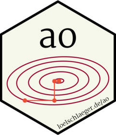

<!-- README.md is generated from README.Rmd. Please edit that file -->

```{r setup, include = FALSE}
knitr::opts_chunk$set(
  collapse = TRUE,
  comment = "#>",
  fig.path = "vignettes/README-"
)
library("ao")
```

# Alternating optimization 

<!-- badges: start -->
[](https://CRAN.R-project.org/package=ao)
[](https://CRAN.R-project.org/package=ao)
[](https://github.com/loelschlaeger/ao/actions)
[](https://app.codecov.io/gh/loelschlaeger/ao?branch=main)
<!-- badges: end -->

The `{ao}` package offers useRs easy access to alternating optimization.

## Why?

Alternating optimization is an iterative procedure that optimizes a function by alternately performing restricted optimization over individual parameter subsets. Instead of tackling joint optimization directly, it breaks the problem down into simpler sub-problems. This approach can make optimization feasible when joint optimization is too difficult. For more details, please refer to the [package vignette](https://loelschlaeger.de/ao/articles/ao.html).

## How?

You can install the released package version from [CRAN](https://CRAN.R-project.org) with:

``` r
install.packages("ao")
```

Then load the package via `library("ao")` and you should be ready to go. Here is a simple example of alternating minimization of the [Rosenbrock function](https://en.wikipedia.org/wiki/Rosenbrock_function):

```{r, ao rosenbrock}
rosenbrock <- function(x) (1 - x[1])^2 + (x[2] - x[1]^2)^2
ao(f = rosenbrock, initial = c(2, 2))
```

```{r, rosenbrock_ao_path, echo = FALSE}
out <- ao(f = rosenbrock, initial = c(2, 2))
library("ggplot2")
x <- y <- seq(0.9, 2.1, 0.05)
grid <- expand.grid(x, y)
grid$z <- apply(grid, 1, rosenbrock)
ggplot(grid) +
  geom_raster(aes(x = Var1, y = Var2, fill = z)) +
  geom_contour(aes(x = Var1, y = Var2, z = z), colour = "white", bins = 40) +
  scale_fill_gradient(low = "blue", high = "red") +
  theme_minimal() +
  theme(
    axis.text.y = element_text(angle = 90)
  ) +
  labs(
    x = "x",
    y = "y",
    fill = "value",
    title = "Rosenbrock function with AO path"
  ) +
  coord_fixed() + 
  scale_x_continuous(breaks = c(1, 2)) +
  scale_y_continuous(breaks = c(1, 2)) +
  geom_path(
    data = out$details, aes(x = p1, y = p2), linewidth = 1
  ) 
```

## Contact?

If you have a question, found a bug, want to request a feature, give feedback, or contribute, we would love to hear from you. [Please file an issue on GitHub](https://github.com/loelschlaeger/ao/issues/new/choose). 😊
