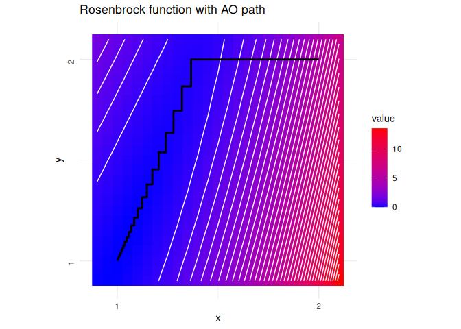

<!-- README.md is generated from README.Rmd. Please edit that file -->

# Alternating optimization 

<!-- badges: start -->

[](https://CRAN.R-project.org/package=ao)
[](https://CRAN.R-project.org/package=ao)
[](https://github.com/loelschlaeger/ao/actions)
[](https://github.com/loelschlaeger/ao/actions)
[](https://app.codecov.io/gh/loelschlaeger/ao?branch=main)
<!-- badges: end -->

The `{ao}` package implements alternating optimization (AO) in
[R](https://cran.r-project.org/).

## Why?

AO is an iterative process that optimizes a function by alternately
performing restricted optimization over parameter subsets. Instead of
joint optimization, it breaks the optimization problem down into simpler
sub-problems. This approach can make optimization feasible when joint
optimization is too difficult. See the [package
vignette](https://loelschlaeger.de/ao/articles/ao.html) for more
details.

## How?

You can install the released package version from
[CRAN](https://CRAN.R-project.org) with:

``` r
install.packages("ao")
```

Then load the package via `library("ao")` and you should be ready to go.
Here is a simple example of alternating minimization of the [Rosenbrock
function](https://en.wikipedia.org/wiki/Rosenbrock_function):

``` r
rosenbrock <- function(x) (1 - x[1])^2 + (x[2] - x[1]^2)^2
```

The resulting optimization path …

<!-- -->

… is obtained as follows:

``` r
ao(f = rosenbrock, initial = c(2, 2), add_details = TRUE)
#> $estimate
#> [1] 1.000895 1.001791
#> 
#> $value
#> [1] 8.016137e-07
#> 
#> $details
#>    iteration        value       p1       p2 b1 b2     seconds
#> 1          0 5.000000e+00 2.000000 2.000000  0  0 0.000000000
#> 2          1 1.519238e-01 1.366025 2.000000  1  0 0.006363869
#> 3          1 1.339744e-01 1.366025 1.866024  0  1 0.002068996
#> 4          2 1.176778e-01 1.320824 1.866024  1  0 0.002699137
#> 5          2 1.029278e-01 1.320824 1.744575  0  1 0.002110958
#> 6          3 8.966402e-02 1.278883 1.744575  1  0 0.002901077
#> 7          3 7.777546e-02 1.278883 1.635540  0  1 0.001904011
#> 8          4 6.719114e-02 1.240415 1.635540  1  0 0.003144026
#> 9          4 5.779955e-02 1.240415 1.538630  0  1 0.001903057
#> 10         5 4.952339e-02 1.205560 1.538630  1  0 0.009890079
#> 11         5 4.225482e-02 1.205560 1.453374  0  1 0.002016068
#> 12         6 3.591491e-02 1.174366 1.453374  1  0 0.002801895
#> 13         6 3.040344e-02 1.174366 1.379135  0  1 0.001818895
#> 14         7 2.564430e-02 1.146792 1.379135  1  0 0.003333092
#> 15         7 2.154801e-02 1.146792 1.315133  0  1 0.002017021
#> 16         8 1.804492e-02 1.122712 1.315133  1  0 0.003165960
#> 17         8 1.505832e-02 1.122712 1.260483  0  1 0.002074957
#> 18         9 1.252724e-02 1.101923 1.260483  1  0 0.003380060
#> 19         9 1.038836e-02 1.101923 1.214235  0  1 0.001863956
#> 20        10 8.590837e-03 1.084167 1.214235  1  0 0.006909132
#> 21        10 7.084101e-03 1.084167 1.175418  0  1 0.001886129
#> 22        11 5.827377e-03 1.069149 1.175418  1  0 0.006983995
#> 23        11 4.781578e-03 1.069149 1.143079  0  1 0.001940012
#> 24        12 3.915156e-03 1.056558 1.143079  1  0 0.006923914
#> 25        12 3.198754e-03 1.056558 1.116314  0  1 0.003469944
#> 26        13 2.608707e-03 1.046082 1.116314  1  0 0.018738031
#> 27        13 2.123531e-03 1.046082 1.094287  0  1 0.001847029
#> 28        14 1.725945e-03 1.037424 1.094287  1  0 0.002201080
#> 29        14 1.400576e-03 1.037424 1.076249  0  1 0.001825809
#> 30        15 1.135093e-03 1.030310 1.076249  1  0 0.002213955
#> 31        15 9.187038e-04 1.030310 1.061539  0  1 0.001797915
#> 32        16 7.427825e-04 1.024492 1.061539  1  0 0.002194881
#> 33        16 5.998755e-04 1.024492 1.049585  0  1 0.001878977
#> 34        17 4.840462e-04 1.019754 1.049585  1  0 0.002230883
#> 35        17 3.902161e-04 1.019754 1.039898  0  1 0.001816034
#> 36        18 3.143566e-04 1.015907 1.039898  1  0 0.002327919
#> 37        18 2.530454e-04 1.015907 1.032068  0  1 0.002080917
#> 38        19 2.035803e-04 1.012794 1.032068  1  0 0.002326012
#> 39        19 1.636760e-04 1.012794 1.025751  0  1 0.001852989
#> 40        20 1.315375e-04 1.010279 1.025751  1  0 0.002521038
#> 41        20 1.056496e-04 1.010279 1.020663  0  1 0.002076864
#> 42        21 8.482978e-05 1.008251 1.020663  1  0 0.002562046
#> 43        21 6.807922e-05 1.008251 1.016570  0  1 0.001961946
#> 44        22 5.462405e-05 1.006619 1.016570  1  0 0.002355099
#> 45        22 4.380882e-05 1.006619 1.013281  0  1 0.001914978
#> 46        23 3.513011e-05 1.005307 1.013281  1  0 0.002474070
#> 47        23 2.815916e-05 1.005307 1.010641  0  1 0.002257109
#> 48        24 2.257018e-05 1.004252 1.010641  1  0 0.002510071
#> 49        24 1.808332e-05 1.004252 1.008523  0  1 0.002375126
#> 50        25 1.448872e-05 1.003406 1.008523  1  0 0.002344847
#> 51        25 1.160399e-05 1.003406 1.006825  0  1 0.001878977
#> 52        26 9.294548e-06 1.002728 1.006825  1  0 0.002475977
#> 53        26 7.441548e-06 1.002728 1.005463  0  1 0.001852989
#> 54        27 5.959072e-06 1.002184 1.005463  1  0 0.002201080
#> 55        27 4.769667e-06 1.002184 1.004373  0  1 0.001419067
#> 56        28 3.818729e-06 1.001748 1.004373  1  0 0.002189875
#> 57        28 3.055717e-06 1.001748 1.003499  0  1 0.001791000
#> 58        29 2.446111e-06 1.001399 1.003499  1  0 0.002210140
#> 59        29 1.956863e-06 1.001399 1.002800  0  1 0.001793861
#> 60        30 1.566279e-06 1.001119 1.002800  1  0 0.004199028
#> 61        30 1.252688e-06 1.001119 1.002240  0  1 0.002015114
#> 62        31 1.002554e-06 1.000895 1.002240  1  0 0.002316952
#> 63        31 8.016137e-07 1.000895 1.001791  0  1 0.001415968
#> 
#> $seconds
#> [1] 0.1820159
#> 
#> $stopping_reason
#> [1] "change in function value between 1 iteration is < 1e-06"
```

## Contact?

If you have any questions, found a bug, need a feature, [just file an
issue on GitHub](https://github.com/loelschlaeger/ao/issues/new/choose).
