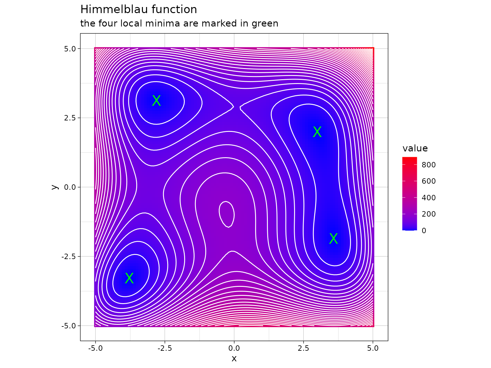
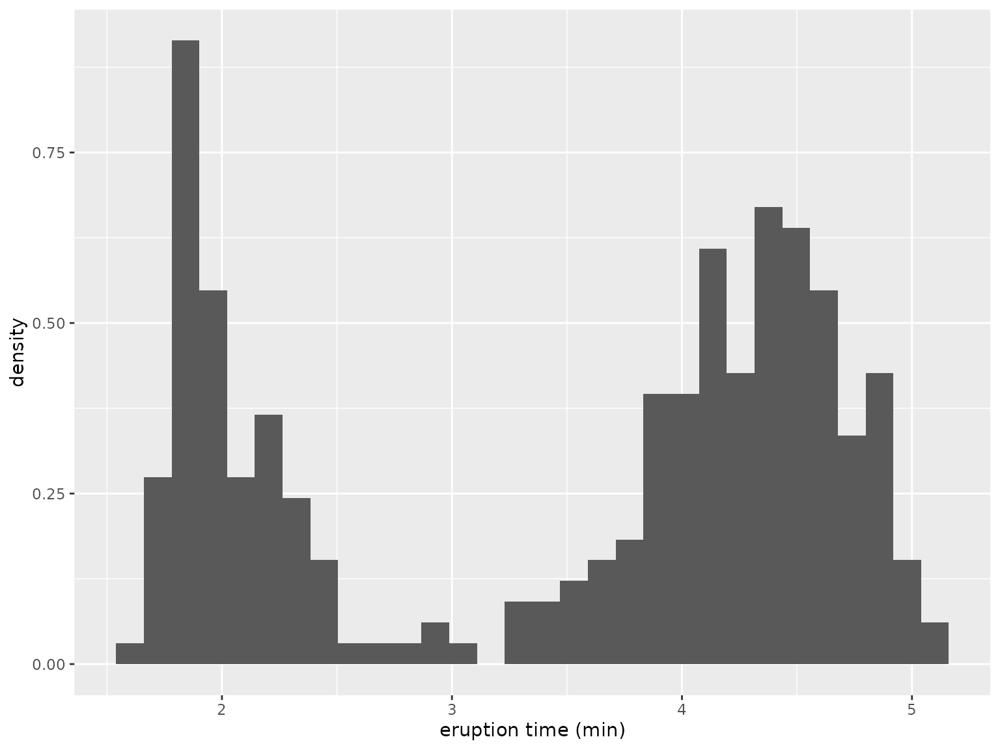

# Alternating optimization

The [ao](https://loelschlaeger.de/ao/) package implements alternating
optimization in R. This vignette demonstrates how to use the package and
describes the available customization options.

## What is alternating optimization?

Alternating optimization (AO) is an iterative process for optimizing a
multivariate function by breaking it down into simpler sub-problems. It
involves optimizing over one block of function parameters while keeping
the others fixed, and then alternating this process among the parameter
blocks. AO is particularly useful when the sub-problems are easier to
solve than the original joint optimization problem, or when there is a
natural partitioning of the parameters. See Bezdek and Hathaway
([2002](#ref-bezdek:2002)), Hu and Hathaway ([2002](#ref-hu:2002)), and
Bezdek and Hathaway ([2003](#ref-bezdek:2003)) for more details.

Consider a real-valued **objective** function $f(\mathbf{x},\mathbf{y})$
where $\mathbf{x}$ and $\mathbf{y}$ are two **blocks** of function
parameters, namely a **partition** of the parameters. The AO process can
be described as follows:

1.  **Initialization**: Start with initial guesses $\mathbf{x}^{(0)}$
    and $\mathbf{y}^{(0)}$.

2.  **Iterative Steps**: For $k = 0,1,2,\ldots$

    - **Step 1**: Fix $\mathbf{y} = \mathbf{y}^{(k)}$ and solve the
      sub-problem
      $$\mathbf{x}^{(k + 1)} = \arg\min\limits_{\mathbf{x}}f\left( \mathbf{x},\mathbf{y}^{(k)} \right).$$
    - **Step 2**: Fix $\mathbf{x} = \mathbf{x}^{(k + 1)}$ and solve the
      sub-problem
      $$\mathbf{y}^{(k + 1)} = \arg\min\limits_{\mathbf{y}}f\left( \mathbf{x}^{(k + 1)},\mathbf{y} \right).$$

3.  **Convergence**: Repeat the iterative steps until a **convergence
    criterion** is met, such as when the change in the objective
    function or the parameters falls below a specified threshold, or
    when a pre-defined iteration limit is reached.

The AO process can be

- viewed as a generalization of joint optimization, where the parameter
  partition is trivial, consisting of the entire parameter vector as a
  single block,

- also used for maximization problems by simply replacing $\arg\min$ by
  $\arg\max$ above,

- generalized to more than two parameter blocks, i.e., for
  $f\left( \mathbf{x}_{1},\mathbf{x}_{2},\ldots,\mathbf{x}_{n} \right)$,
  the process involves cycling through each parameter block
  $\mathbf{x}_{1},\mathbf{x}_{2},\ldots,\mathbf{x}_{n}$ and solving the
  corresponding sub-problems iteratively (the parameter blocks do not
  necessarily have to be disjoint),

- **randomized** by changing the parameter partition randomly after each
  iteration, which can further improve the convergence rate and help
  avoid getting trapped in local optima ([Chib and Ramamurthy
  2010](#ref-chib:2010)),

- run in **multiple processes** for different initial values, parameter
  partitions, and/or base optimizers.

## How to use the package?

The [ao](https://loelschlaeger.de/ao/) package provides a single
user-level function,
[`ao()`](https://loelschlaeger.de/ao/reference/ao.md), which serves as a
general interface for performing various variants of AO.

### The function call

The [`ao()`](https://loelschlaeger.de/ao/reference/ao.md) function call
with the default arguments looks as follows:

``` r
ao(
  f,
  initial,
  target = NULL,
  npar = NULL,
  gradient = NULL,
  hessian = NULL,
  ...,
  partition = "sequential",
  new_block_probability = 0.3,
  minimum_block_number = 1,
  minimize = TRUE,
  lower = NULL,
  upper = NULL,
  iteration_limit = Inf,
  seconds_limit = Inf,
  tolerance_value = 1e-6,
  tolerance_parameter = 1e-6,
  tolerance_parameter_norm = function(x, y) sqrt(sum((x - y)^2)),
  tolerance_history = 1,
  base_optimizer = Optimizer$new("stats::optim", method = "L-BFGS-B"),
  verbose = FALSE,
  hide_warnings = TRUE,
  add_details = TRUE
)
```

The arguments have the following meaning:

- `f`: The objective function to be optimized. By default, `f` is
  optimized over its first argument. If optimization should target a
  different argument or multiple arguments, use `npar` and `target`,
  [see below](#generalized-objective-functions). Additional arguments
  for `f` can be passed via the `...` argument as usual.

- `initial`: Initial values for the parameters used in the AO process.

- `gradient` and `hessian`: Optional arguments to specify the analytical
  gradient and/or Hessian of `f`.

- `partition`: Specifies how parameters are partitioned for
  optimization. Can be one of the following:

  - `"sequential"`: Optimizes each parameter block sequentially. This is
    similar to [coordinate
    descent](https://en.wikipedia.org/wiki/Coordinate_descent).

  - `"random"`: Randomly partitions parameters in each iteration.

  - `"none"`: No partitioning; equivalent to joint optimization.

  - Custom partition can be defined using a list of vectors of parameter
    indices, [see below](#custom-parameter-partition).

- `new_block_probability` and `minimum_block_number` are only relevant
  if `partition = "random"`. In this case, the former controls the
  probability for creating a new block when building a random parameter
  partition, and the latter defines the minimum number of parameter
  blocks in the partition.

- `minimize`: Set to `TRUE` for minimization (default), or `FALSE` for
  maximization.

- `lower` and `upper`: Lower and upper limits for constrained
  optimization.

- `iteration_limit` is the maximum number of AO iterations before
  termination, while `seconds_limit` is the time limit in seconds.
  `tolerance_value` and `tolerance_parameter` (in combination with
  `tolerance_parameter_norm`) specify two other stopping criteria,
  namely when the difference between the current function value or the
  current parameter vector and the one before `tolerance_history`
  iterations, respectively, becomes smaller than these thresholds.

- `base_optimizer`: Numerical optimizer used for solving sub-problems,
  [see below](#base-optimizer).

- Set `verbose` to `TRUE` to print status messages, and `hide_warnings`
  to `FALSE` to show warning messages during the AO process.
  `add_details = TRUE` adds additional details about the AO process to
  the output.

### A simple first example

The following is an implementation of the [Himmelblau’s
function](https://en.wikipedia.org/wiki/Himmelblau%27s_function)
$$f(x,y) = \left( x^{2} + y - 11 \right)^{2} + \left( x + y^{2} - 7 \right)^{2}:$$

``` r
himmelblau <- function(x) (x[1]^2 + x[2] - 11)^2 + (x[1] + x[2]^2 - 7)^2
```

This function has four identical local minima, for example in $x = 3$
and $y = 2$:

``` r
himmelblau(c(3, 2))
#> [1] 0
```



Minimizing Himmelblau’s function through alternating minimization over
$\mathbf{x}$ and $\mathbf{y}$ with initial values
$\mathbf{x}^{(0)} = \mathbf{y}^{(0)} = 0$ can be accomplished as
follows:

``` r
ao(f = himmelblau, initial = c(0, 0))
#> $estimate
#> [1]  3.584428 -1.848126
#> 
#> $value
#> [1] 9.606386e-12
#> 
#> $details
#>    iteration        value       p1        p2 b1 b2     seconds
#> 1          0 1.700000e+02 0.000000  0.000000  0  0 0.000000000
#> 2          1 1.327270e+01 3.395691  0.000000  1  0 0.046252251
#> 3          1 1.743664e+00 3.395691 -1.803183  0  1 0.010555267
#> 4          2 2.847290e-02 3.581412 -1.803183  1  0 0.007988214
#> 5          2 4.687468e-04 3.581412 -1.847412  0  1 0.006888866
#> 6          3 7.368057e-06 3.584381 -1.847412  1  0 0.005846977
#> 7          3 1.164202e-07 3.584381 -1.848115  0  1 0.054032564
#> 8          4 1.893311e-09 3.584427 -1.848115  1  0 0.004757404
#> 9          4 9.153860e-11 3.584427 -1.848124  0  1 0.003518105
#> 10         5 6.347425e-11 3.584428 -1.848124  1  0 0.003552437
#> 11         5 9.606386e-12 3.584428 -1.848126  0  1 0.003607750
#> 
#> $seconds
#> [1] 0.1469998
#> 
#> $stopping_reason
#> [1] "change in function value between 1 iteration is < 1e-06"
```

Here, we see the output of the AO process, which is a `list` that
contains the following elements:

- `estimate` is the parameter vector at termination.

- `value` is the function value at termination.

- `details` is a `data.frame` with full information about the process:
  For each iteration (column `iteration`) it contains the function value
  (column `value`), parameter values (columns starting with `p` followed
  by the parameter index), the active parameter block (columns starting
  with `b` followed by the parameter index, where `1` stands for a
  parameter contained in the active parameter block and `0` if not), and
  computation times in seconds (column `seconds`).

- `seconds` is the overall computation time in seconds.

- `stopping_reason` is a message why the process has terminated.

### Using the analytical gradient

For the Himmelblau’s function, it is straightforward to define the
analytical gradient as follows:

``` r
gradient <- function(x) {
  c(
    4 * x[1] * (x[1]^2 + x[2] - 11) + 2 * (x[1] + x[2]^2 - 7),
    2 * (x[1]^2 + x[2] - 11) + 4 * x[2] * (x[1] + x[2]^2 - 7)
  )
}
```

The gradient function is used by
[`ao()`](https://loelschlaeger.de/ao/reference/ao.md) if provided via
the `gradient` argument as follows:

``` r
ao(f = himmelblau, initial = c(0, 0), gradient = gradient, add_details = FALSE)
#> $estimate
#> [1]  3.584428 -1.848126
#> 
#> $value
#> [1] 2.659691e-12
#> 
#> $seconds
#> [1] 0.06115723
#> 
#> $stopping_reason
#> [1] "change in function value between 1 iteration is < 1e-06"
```

In scenarios involving higher dimensions, utilizing the analytical
gradient can notably improve both the speed and stability of the
process. The analytical Hessian can be utilized analogously.

### Random parameter partitions

Another version of the AO process involves using a new, random partition
of the parameters in every iteration. This approach can enhance the
convergence rate and prevent being stuck in local optima. It is
activated by setting `partition = "random"`. The randomness can be
adjusted using two parameters:

- `new_block_probability` determines the probability for creating a new
  block when building a new partition. Its value ranges from `0` (no
  blocks are created) to `1` (each parameter is a single block).

- `minimum_block_number` sets the minimum number of parameter blocks for
  random partitions. Here, it is configured as `2` to avoid generating
  trivial partitions.

The random partitions are build as follows:[¹](#fn1)

``` r
process <- ao:::Process$new(
  npar = 10,
  partition = "random",
  new_block_probability = 0.5,
  minimum_block_number = 2
)
process$get_partition()
#> [[1]]
#> [1] 5
#> 
#> [[2]]
#> [1] 1 6 9
#> 
#> [[3]]
#> [1] 10
#> 
#> [[4]]
#> [1] 7
#> 
#> [[5]]
#> [1] 4 8
#> 
#> [[6]]
#> [1] 2 3
process$get_partition()
#> [[1]]
#> [1] 1 7 8
#> 
#> [[2]]
#> [1]  6 10
#> 
#> [[3]]
#> [1] 3 4
#> 
#> [[4]]
#> [1] 2
#> 
#> [[5]]
#> [1] 9
#> 
#> [[6]]
#> [1] 5
```

As an example of AO with random partitions, consider fitting a two-class
Gaussian mixture model via maximizing the model’s log-likelihood
function

$$\ell({\mathbf{θ}}) = \sum\limits_{i = 1}^{n}\log(\lambda\phi_{\mu_{1},\sigma_{1}^{2}}\left( x_{i} \right) + (1 - \lambda)\phi_{\mu_{2},\sigma_{2}^{2}}\left( x_{i} \right)),$$

where the sum goes over all observations $x_{1},\ldots,x_{n}$,
$\phi_{\mu_{1},\sigma_{1}^{2}}$ and $\phi_{\mu_{2},\sigma_{2}^{2}}$
denote the normal density for the first and second cluster,
respectively, and $\lambda$ is the mixing proportion. The parameter
vector to be estimated is
${\mathbf{θ}} = \left( \mu_{1},\mu_{2},\sigma_{1},\sigma_{2},\lambda \right)$.
As there exists no closed-form solution for the maximum likelihood
estimator ${\mathbf{θ}}^{*} = \arg\max_{\mathbf{θ}}\ell({\mathbf{θ}})$,
we apply numerical optimization to find the function optimum. The model
is fitted to the following data:[²](#fn2)



The following function calculates the log-likelihood value given the
parameter vector `theta` and the observation vector `data`:[³](#fn3)

``` r
normal_mixture_llk <- function(theta, data) {
  mu <- theta[1:2]
  sd <- exp(theta[3:4])
  lambda <- plogis(theta[5])
  c1 <- lambda * dnorm(data, mu[1], sd[1])
  c2 <- (1 - lambda) * dnorm(data, mu[2], sd[2])
  sum(log(c1 + c2))
}
```

The [`ao()`](https://loelschlaeger.de/ao/reference/ao.md) call for
performing alternating *maximization* with random partitions looks as
follows, where we simplified the output for brevity:

``` r
out <- ao(
  f = normal_mixture_llk,
  initial = runif(5),
  data = datasets::faithful$eruptions,
  partition = "random",
  minimize = FALSE
)
round(out$details, 2)
#>    iteration   value   p1   p2    p3    p4    p5 b1 b2 b3 b4 b5 seconds
#> 1          0 -713.98 0.94 0.79  0.97  0.35  0.50  0  0  0  0  0    0.00
#> 2          1 -541.18 0.94 3.81  0.97  0.35  0.50  0  1  0  0  0    0.01
#> 3          1 -512.65 0.94 3.81  0.66 -0.30  0.50  0  0  1  1  0    0.02
#> 4          1 -447.85 3.08 3.81  0.66 -0.30  0.50  1  0  0  0  0    0.01
#> 5          1 -445.29 3.08 3.81  0.66 -0.30 -0.04  0  0  0  0  1    0.01
#> 6          2 -277.37 2.02 4.27 -1.55 -0.83 -0.55  1  1  1  1  1    0.08
#> 7          3 -276.36 2.02 4.27 -1.45 -0.83 -0.63  1  1  1  1  1    0.07
#> 8          4 -276.36 2.02 4.27 -1.45 -0.83 -0.63  0  1  0  0  0    0.00
#> 9          4 -276.36 2.02 4.27 -1.45 -0.83 -0.63  0  0  1  0  1    0.01
#> 10         4 -276.36 2.02 4.27 -1.45 -0.83 -0.63  1  0  0  1  0    0.01
#> 11         5 -276.36 2.02 4.27 -1.45 -0.83 -0.63  1  0  0  1  1    0.01
#> 12         5 -276.36 2.02 4.27 -1.45 -0.83 -0.63  0  0  1  0  0    0.00
#> 13         5 -276.36 2.02 4.27 -1.45 -0.83 -0.63  0  1  0  0  0    0.00
#> 14         6 -276.36 2.02 4.27 -1.45 -0.83 -0.63  1  1  0  1  0    0.01
#> 15         6 -276.36 2.02 4.27 -1.45 -0.83 -0.63  0  0  0  0  1    0.00
#> 16         6 -276.36 2.02 4.27 -1.45 -0.83 -0.63  0  0  1  0  0    0.00
```

### More flexibility

The [ao](https://loelschlaeger.de/ao/) package offers some flexibility
for performing AO.[⁴](#fn4)

#### Generalized objective functions

Optimizers in R generally require that the objective function has a
single target argument which must be in the first position, but
[ao](https://loelschlaeger.de/ao/) allows for optimization over an
argument other than the first, or more than one argument. For example,
say, the `normal_mixture_llk` function above has the following form and
is supposed to be optimized over the parameters `mu`, `lsd`, and
`llambda`:

``` r
normal_mixture_llk <- function(data, mu, lsd, llambda) {
  sd <- exp(lsd)
  lambda <- plogis(llambda)
  c1 <- lambda * dnorm(data, mu[1], sd[1])
  c2 <- (1 - lambda) * dnorm(data, mu[2], sd[2])
  sum(log(c1 + c2))
}
```

In [`ao()`](https://loelschlaeger.de/ao/reference/ao.md), this scenario
can be specified by setting

- `target = c("mu", "lsd", "llambda")` (the names of the target
  arguments)

- and `npar = c(2, 2, 1)` (the lengths of the target arguments):

``` r
ao(
  f = normal_mixture_llk,
  initial = runif(5),
  target = c("mu", "lsd", "llambda"),
  npar = c(2, 2, 1),
  data = datasets::faithful$eruptions,
  partition = "random",
  minimize = FALSE
)
```

#### Parameter bounds

Instead of using parameter transformations in the `normal_mixture_llk()`
function above, parameter bounds can be specified via the arguments
`lower` and `upper`, where both can either be a single number (a common
bound for all parameters) or a vector of specific bounds per parameter.
Therefore, an more straightforward implementation of the mixture example
would be:

``` r
normal_mixture_llk <- function(mu, sd, lambda, data) {
  c1 <- lambda * dnorm(data, mu[1], sd[1])
  c2 <- (1 - lambda) * dnorm(data, mu[2], sd[2])
  sum(log(c1 + c2))
}
ao(
  f = normal_mixture_llk,
  initial = runif(5),
  target = c("mu", "sd", "lambda"),
  npar = c(2, 2, 1),
  data = datasets::faithful$eruptions,
  partition = "random",
  minimize = FALSE,
  lower = c(-Inf, -Inf, 0, 0, 0),
  upper = c(Inf, Inf, Inf, Inf, 1)
)
```

#### Custom parameter partition

Say the parameters of the Gaussian mixture model are supposed to be
grouped by type:

$$\mathbf{x}_{1} = \left( \mu_{1},\mu_{2} \right),\ \mathbf{x}_{2} = \left( \sigma_{1},\sigma_{2} \right),\ \mathbf{x}_{3} = (\lambda).$$

In [`ao()`](https://loelschlaeger.de/ao/reference/ao.md), custom
parameter partitions can be specified by setting
`partition = list(1:2, 3:4, 5)`, i.e. by defining a `list` where each
element corresponds to a parameter block, containing a vector of
parameter indices. Parameter indices can be members of any number of
blocks.

#### Stopping criteria

Currently, four different stopping criteria for the AO process are
implemented:

1.  a predefined iteration limit is exceeded (via the `iteration_limit`
    argument)

2.  a predefined time limit is exceeded (via the `seconds_limit`
    argument)

3.  the absolute change in the function value in comparison to the last
    iteration falls below a predefined threshold (via the
    `tolerance_value` argument)

4.  the change in parameters in comparison to the last iteration falls
    below a predefined threshold (via the `tolerance_parameter`
    argument, where the parameter distance is computed via the norm
    specified as `tolerance_parameter_norm`)

Any number of stopping criteria can be activated or
deactivated[⁵](#fn5), and the final output contains information about
the criterium that caused termination.

#### Base optimizer

By default, the L-BFGS-B algorithm ([Byrd et al. 1995](#ref-byrd:1995))
implemented in [`stats::optim`](https://rdrr.io/r/stats/optim.html) is
used for solving the sub-problems numerically. However, any other
optimizer can be selected by specifying the `base_optimizer` argument.
Such an optimizer must be defined through the framework provided by the
[optimizeR](https://loelschlaeger.de/optimizeR/) package, see [its
documentation](https://loelschlaeger.de/optimizeR/) for details. For
example, the [`stats::nlm`](https://rdrr.io/r/stats/nlm.html) optimizer
can be selected by setting
`base_optimizer = Optimizer$new("stats::nlm")`.

#### Multiple processes

AO can suffer from local optima. To increase the likelihood of reaching
the global optimum, users can specify

- multiple starting parameters,

- multiple parameter partitions,

- multiple base optimizers.

Use the `initial`, `partition`, and/or `base_optimizer` arguments to
provide a `list` of possible values for each parameter. Each combination
of initial values, parameter partitions, and base optimizers will create
a separate AO process:

``` r
normal_mixture_llk <- function(mu, sd, lambda, data) {
  c1 <- lambda * dnorm(data, mu[1], sd[1])
  c2 <- (1 - lambda) * dnorm(data, mu[2], sd[2])
  sum(log(c1 + c2))
}
out <- ao(
  f = normal_mixture_llk,
  initial = list(runif(5), runif(5)),
  target = c("mu", "sd", "lambda"),
  npar = c(2, 2, 1),
  data = datasets::faithful$eruptions,
  partition = list("random", "random", "random"),
  minimize = FALSE,
  lower = c(-Inf, -Inf, 0, 0, 0),
  upper = c(Inf, Inf, Inf, Inf, 1)
)
names(out)
#>  [1] "estimate"         "estimates"        "estimate_split"   "value"           
#>  [5] "values"           "details"          "seconds"          "seconds_each"    
#>  [9] "stopping_reason"  "stopping_reasons" "processes"
out$values
#> [[1]]
#> [1] -421.417
#> 
#> [[2]]
#> [1] -421.417
#> 
#> [[3]]
#> [1] -585.2514
#> 
#> [[4]]
#> [1] -276.36
#> 
#> [[5]]
#> [1] -395.9705
#> 
#> [[6]]
#> [1] -421.417
```

In the case of multiple processes, the output provides information for
the best process (with respect to the function value) as well as
information on every single process.

By default, processes run sequentially. However, since they are
independent of each other, they can be parallelized. For parallel
computation, [ao](https://loelschlaeger.de/ao/) supports the [`{future}`
framework](https://future.futureverse.org/). For example, run the
following *before* the
[`ao()`](https://loelschlaeger.de/ao/reference/ao.md) call:

``` r
future::plan(future::multisession, workers = 4)
```

When using multiple processes, setting `verbose = TRUE` to print tracing
details during AO is not supported. However, progress of processes can
still be tracked using the [`{progressr}`
framework](https://progressr.futureverse.org/). For example, run the
following *before* the
[`ao()`](https://loelschlaeger.de/ao/reference/ao.md) call:

``` r
progressr::handlers(global = TRUE)
progressr::handlers(
  progressr::handler_progress(":percent :eta :message")
)
```

## References

Bezdek, J, and R Hathaway. 2002. “Some Notes on Alternating
Optimization.” *Proceedings of the 2002 AFSS International Conference on
Fuzzy Systems. Calcutta: Advances in Soft Computing*.
<https://doi.org/10.1007/3-540-45631-7_39>.

———. 2003. “Convergence of Alternating Optimization.” *Neural, Parallel
and Scientific Computations* 11 (December): 351–68.

Byrd, Richard H., Peihuang Lu, Jorge Nocedal, and Ciyou Zhu. 1995. “A
Limited Memory Algorithm for Bound Constrained Optimization.” *SIAM
Journal on Scientific Computing* 16 (5): 1190–1208.
<https://doi.org/10.1137/0916069>.

Chang, Winston. 2022. *R6: Encapsulated Classes with Reference
Semantics*.

Chib, Siddhartha, and Srikanth Ramamurthy. 2010. “Tailored Randomized
Block MCMC Methods with Application to DSGE Models.” *Journal of
Econometrics* 155 (1): 19–38.

Hu, Y, and R Hathaway. 2002. “On Efficiency of Optimization in Fuzzy
c-Means.” *Neural, Parallel and Scientific Computations* 10.

------------------------------------------------------------------------

1.  `Process` is an internal R6 object ([Chang 2022](#ref-chang:2022)),
    which users typically do not need to interact with.

2.  The `faithful` data set contains information about eruption times
    (`eruptions`) of the Old Faithful geyser in Yellowstone National
    Park, Wyoming, USA. The data histogram hints at two clusters with
    short and long eruption times, respectively. For both clusters, we
    assume a normal distribution, such that we consider a mixture of two
    Gaussian densities for modeling the overall eruption times.

3.  We restrict the standard deviations `sd` to be positive (via the
    exponential transformation) and `lambda` to be between 0 and 1 (via
    the logit transformation).

4.  Do you miss a functionality? Please let us know via an [issue on
    GitHub](https://github.com/loelschlaeger/ao/issues/new?assignees=&labels=future&projects=&template=suggestion.md).

5.  Stopping criteria of the AO process can be deactivated by setting
    `iteration_limit = Inf`, `seconds_limit = Inf`,
    `tolerance_value = 0`, or `tolerance_parameter = 0`.
